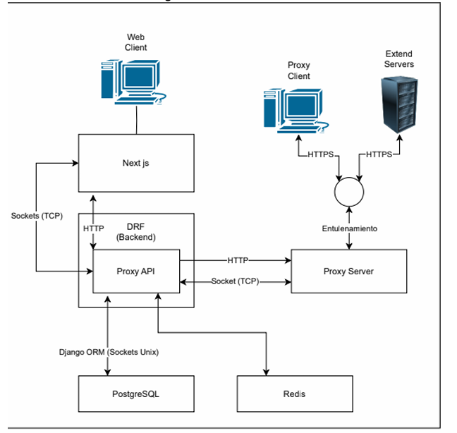
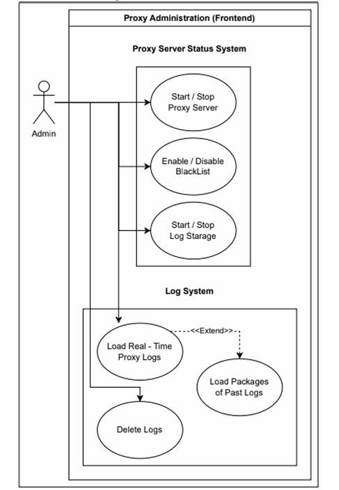
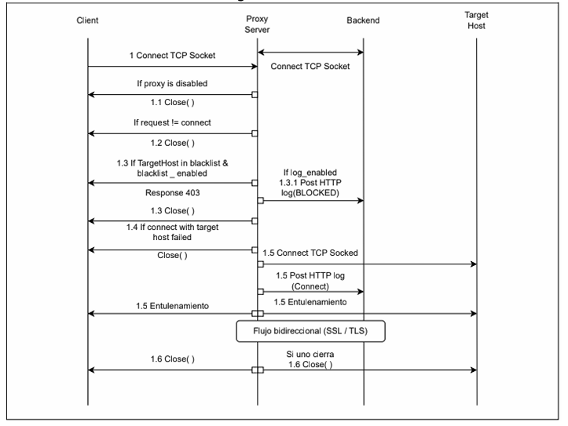

# Home LAN Proxy: HTTPS Proxy Server & Web Admin for LANs
A HTTPS proxy server with a modern web interface for managing proxy settings, enabling/disabling features like blacklist and logging, and monitoring real-time server logs.   

### Frontend:
 
 
 
 
 
 
 
<!--  -->

### Backend:
 
 
 
 

### Databases:
 
 

### Deployment/Tools:
 

## Diagrams

     
    
    

